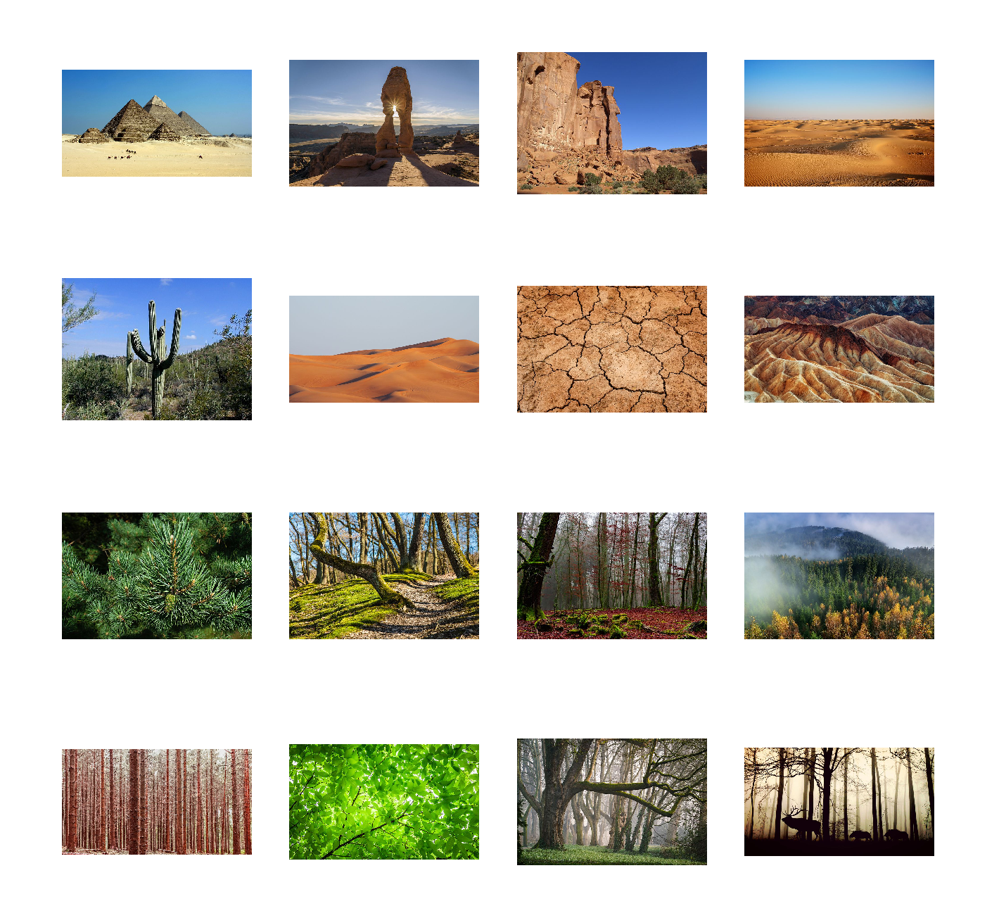
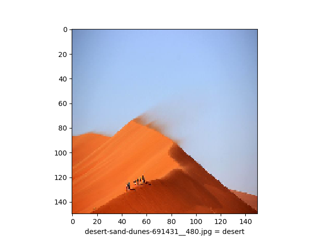
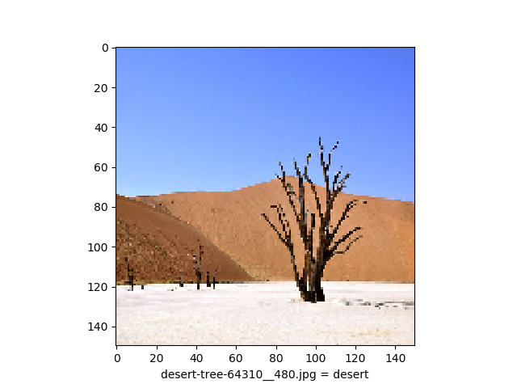
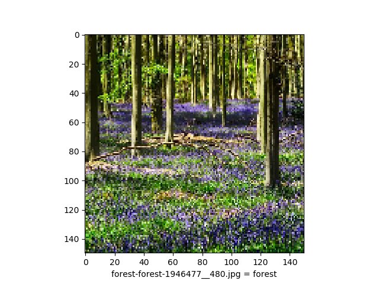
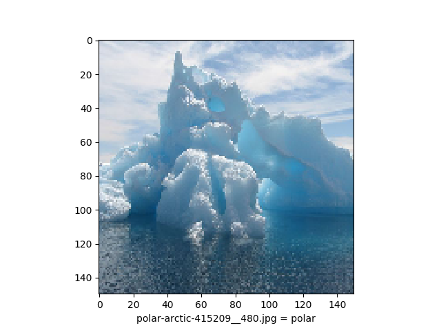
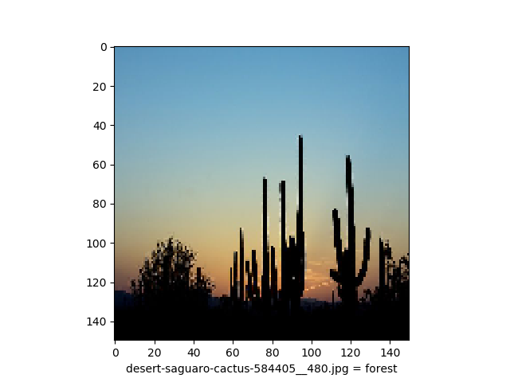
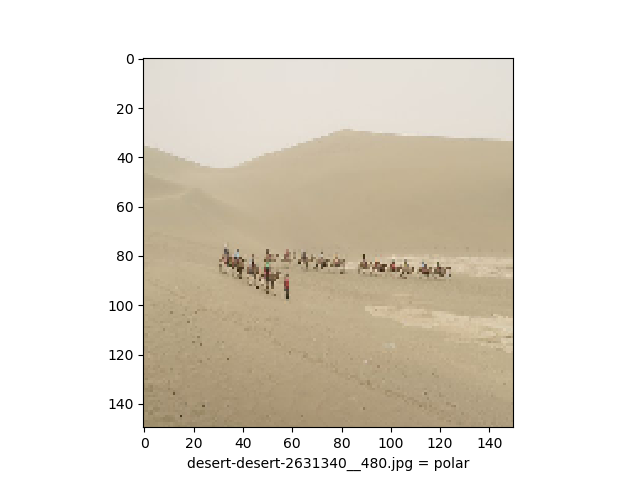
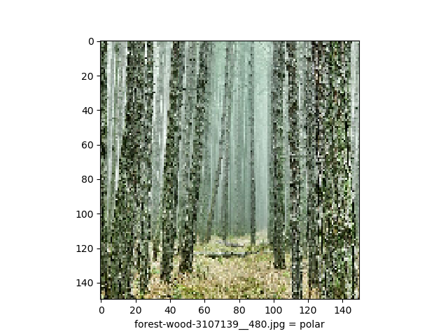

# CNN Landscape Classifier

NOTE: This project was built with Tensorflow 1.14 and Python 3.6.

Convolutional neural network built with TensorFlow/Keras to allow for landscape classification based on one of three categories:
* desert
* forest
* polar.

This project was inspired by and based on an example project of the Coursera course: *Introduction to TensorFlow for Artificial Intelligence, Machine Learning, and Deep Learning*.

Resources:
* Images sourced from Pixabay: https://pixabay.com

## Data and Model Specifications
* Since the dataset images had to be manually obtained, and therefore limited in size, 3 x 70 images were chosen to be of a similar type, and most representative of the landscape type typified. All input images were resized to a 150 x 150 image. The model's accuracy levels can most likely be improved through the use of a larger dataset.
* The validation set consists of 3 x 10 images.
* The model consists of five convolutions and were trained over 30 epochs.

## Datasets
The model was trained on a set of 3 x 70 input images of various sizes. Below is a sample of some of these images:

 

  
  

## Model Results
The program was run over 10 iterations in order to obtain an average validation accuracy.

| Iteration     | Validation Accuracy (%)| Training Accuracy (%) on Epoch 30 |
| :-----------: | ----------------------:| ------:|
| 1             |   93.3333              | 82.86  |
| 2             |   100.0000             | 75.24  |
| 3             |   93.3333              | 87.14  |
| 4             |   90.0000              | 86.67  |
| 5             |   100.0000             | 84.75  |
| 6             |   96.6667              | 87.14  |
| 7             |   100.0000             | 90.48  |
| 8             |   96.6667              | 89.52  |
| 9             |   90.0000              | 78.57  |
| 10            |   96.6667              | 87.62  |

| Average       | Validation Accuracy (%) | Training Accuracy (%) on Epoch 30 |
| :-----------: | -----------------------:| ------:|
|               |   95.6667               | 84.99  |

## Correctly Classified

The images that were correctly classified tend to have strong visual characteristics relating to its type, such as the images below:

 

  
  
  
  

## Misclassifications

Images that were most likely to be misclassified are those that are slightly marginal, for example a forest scene with a lot of orange-brown tones, or a desert scene with a group of cactus trees.

 

  
  
  
  

